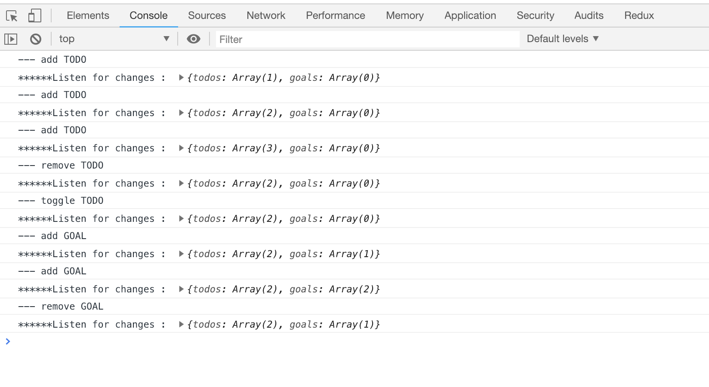

# The purpose of this project
This is a project which allows to see how the redux library works.
The main point targeted here are:
* storing the state
* getting the state
* listening to changes of the state
* updating the state

# Runing the application
 - Open index.html in browser.
 - Open debugger tools  - console
 - In the console appears all the state changes
 
 
 
